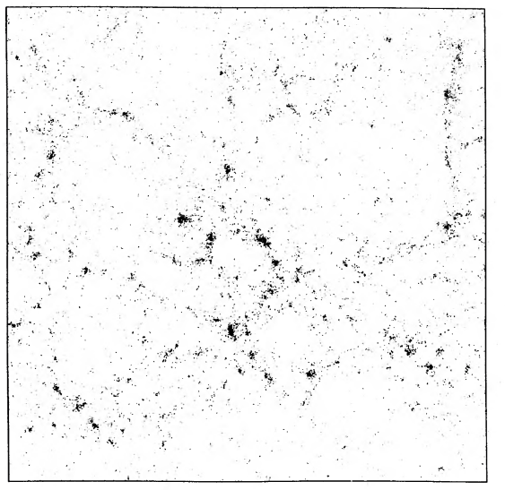

# Differentiable Davis 1985 - Final Report

## JaxPM Forward Simulation

## Time Evolution

Animation showing density field evolution:

## Optimization

## Reconstruction

Target: Figure 1 (lower left) from Davis et al. (1985)

Extracted density field:

